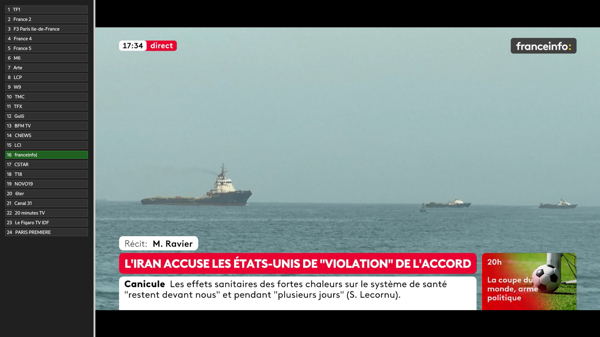
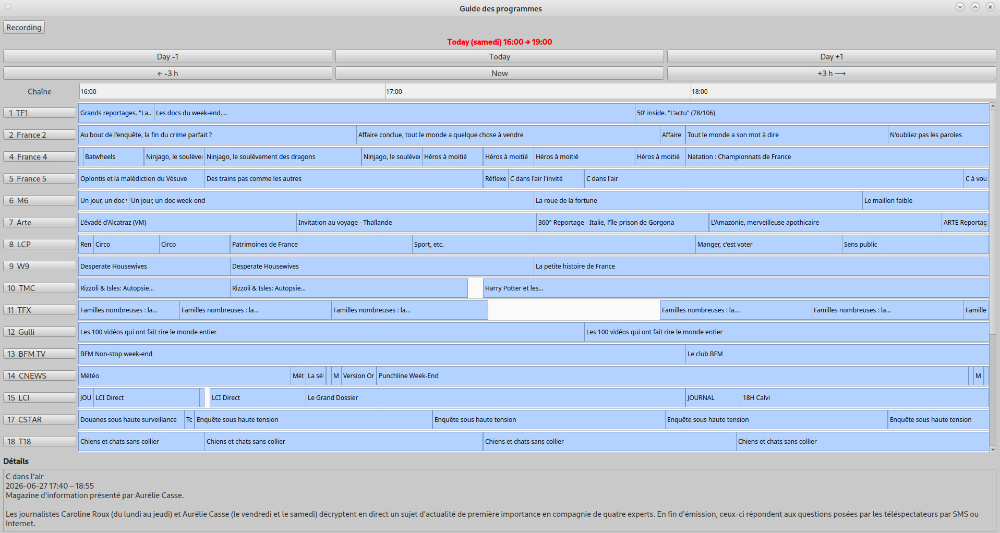
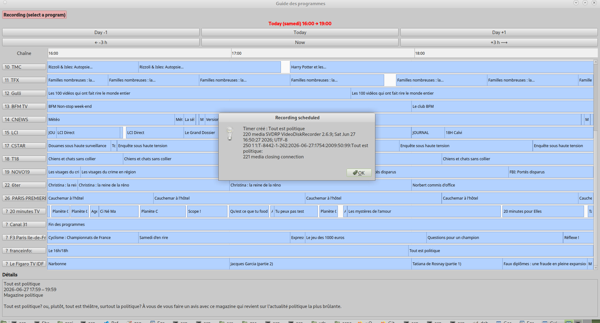
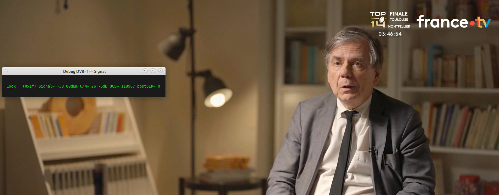

# Gargantua — DVB-T Viewer with Program Guide

## Table of contents

1. [Overview](#1-overview)
2. [System architecture](#2-system-architecture)
3. [Prerequisites and installation](#3-prerequisites-and-installation)
4. [Language support](#4-language-support)
5. [Configuration](#5-configuration)
6. [Running the application](#6-running-the-application)
7. [User interface](#7-user-interface)
8. [Keyboard shortcuts](#8-keyboard-shortcuts)
9. [Features in detail](#9-features-in-detail)
10. [Program guide (EPG)](#10-program-guide-epg)
11. [Recording shows](#11-recording-shows)
12. [DVB signal debug mode](#12-dvb-signal-debug-mode)
13. [Code architecture](#13-code-architecture)
14. [Data flow and network communication](#14-data-flow-and-network-communication)
15. [Troubleshooting](#15-troubleshooting)
16. [Complete technical reference](#16-complete-technical-reference)

---

## 1. Overview

**Gargantua** is a simple TV (DVB-T) viewer application. 

**With a single tuner, Gargantua provides TV, time shift & TV recorder in very room at home in fully secured mode**


In standard mode, the system is based on 2 parts : 
- Lightwight server with DVB-T tuner running "vdr" (Raspberry Pi or old x86 for example). 
- Client computer as TV display.

Both client and server connected thru WIFI, LAN (or even WAN).

One server/tuner supports multiple clients : TV is displayed in every room at home.


### Key Features : 
- Turn your client computer into **full-screen TV** with **time-shift** (DRAM storage)
- Check **TV program guide** thru EPG
- Schedule **TV program recording** thru EPG on VDR server (recorded on HDD/SSD).
- **DVB-T debug mode** (SNR/signal, strength/BER...) available on-demand at client level.

<div align="center">
  <table>
    <tr>
      <td align="center"><b>Full-Screen TV</b><br><a href="images/channel_list_and_screen.jpg"></a></td>
      <td align="center"><b>Program Guide</b><br><a href="images/epg.jpg"></a></td>
    </tr>
    <tr>
      <td align="center"><b>Program Recording</b><br><a href="images/Epg_recording.jpg"></a></td>
      <td align="center"><b>Signal Debug</b><br><a href="images/debug_data.jpg"></a></td>
    </tr>
  </table>
</div>

### What Gargantua does

| Feature | Description |
|---|---|
| Channel zapping | Switch between DVB-T channels available on the VDR server |
| Video playback | HD decoding and display via mpv with hardware acceleration |
| Audio | PipeWire audio output |
| Timeshift | Rewind within the playback buffer (e.g. to rewatch a scene) |
| EPG guide | Display the program grid across multiple days |
| Recording | Schedule and cancel recordings on the VDR server |
| Signal debug | Real-time display of DVB tuner metrics (SNR, C/N, UCB…) |
| TV interface | Fullscreen mode without window decorations, mouse cursor hidden 


### Context

The application is part of a two-machine setup:

- **Client machine**: the machine running Gargantua. This is the viewing screen. Code is in python with :
    - QT6 for the GUI 
    - MPV library for video decoding

Audio is using Pipewire

- **VDR server**: a Linux server equipped with a DVB-T tuner running standard **VDR** (*Video Disk Recorder*) (Open-source software package for managing digital television). Standard VDR running with default configuration.

Communication between the two machines happens **over SSH**, meaning Gargantua requires no open port on the server side other than port 22. The video stream travels securely over an SSH tunnel using HTTP. The program establishes a secure communication channel (SSH) between client and server ports. 

---

## 2. System architecture

```
┌─────────────────────────────────────┐     SSH (port 22)    ┌──────────────────────────────┐
│           CLIENT MACHINE            │◄────────────────────►│          VDR SERVER          │
│                                     │                       │                              │
│  ┌──────────────────────────────┐   │  SSH HTTP tunnel      │  ┌────────────────────────┐ │
│  │       Gargantua (Qt6)        │   │  localhost:8008 ───►  │  │   VDR (vdr-live)       │ │
│  │                              │   │                       │  │   Port 8008 HTTP        │ │
│  │  ┌──────────┐  ┌──────────┐  │   │  svdrpsend LSTC ───►  │  │   SVDRP (commands)     │ │
│  │  │   mpv    │  │  Qt EPG  │  │   │  svdrpsend LSTT ───►  │  │                        │ │
│  │  │ (video)  │  │  (grid)  │  │   │  svdrpsend NEWT ───►  │  │  ┌──────────────────┐  │ │
│  │  └──────────┘  └──────────┘  │   │  svdrpsend DELT ───►  │  │  │  DVB-T tuner     │  │ │
│  │                              │   │                       │  │  │  (DVB-T card)      │  │ │
│  │  ┌──────────────────────┐    │   │  dvb-fe-tool ──────►  │  │  └──────────────────┘  │ │
│  │  │  Signal debug window │    │   │                       │  └────────────────────────┘ │
│  │  └──────────────────────┘    │   │  cat epg.data ─────►  │                              │
│  └──────────────────────────────┘   │                       │  /var/cache/vdr/epg.data     │
│                                     │                       │  /etc/vdr/channels.conf      │
│  PipeWire (local audio)             │                       └──────────────────────────────┘
└─────────────────────────────────────┘
```

### Protocols used

| Protocol | Usage |
|---|---|
| **SSH** (port 22) | All communication with the server |
| **HTTP over SSH tunnel** | TS video stream (MPEG-2/H.264) from VDR to mpv |
| **SVDRP** (via SSH) | VDR commands: channel list, timers, recordings |
| **PipeWire** | Local audio on the client machine |

---

## 3. Prerequisites and installation

### Server side

#### Required software

- **VDR** ≥ 2.6 with the `vdr-plugin-live` plugin (HTTP streaming)
- **svdrpsend**: command-line tool for sending SVDRP commands
- **dvb-fe-tool**: DVB tuner diagnostic tool (`dvb-tools` package)
- A correctly configured and working DVB-T tuner

#### VDR installation and configuration

For detailed instructions on installing and configuring VDR on your server, refer to the official documentation:
- **[VDR Project Documentation](https://www.tvdr.de/)** — Official VDR website with installation guides for various Linux distributions (Debian, Ubuntu, Raspbian, etc.)
- **[VDR on Debian/Ubuntu](https://wiki.debian.org/VDR)** — Debian Wiki guide for VDR installation
- **[VDR Live Plugin](https://www.tvdr.de/wiki/index.php/Plugins#live)** — Plugin documentation and setup instructions

The `vdr-live` plugin must listen on port 8008 locally:

```
# /etc/vdr/plugins/live.conf (example)
-p 8008 -i 127.0.0.1
```

Video streams are accessible at:
```
http://127.0.0.1:8008/TS/<channel_number>
```

### Client side

#### Required software

```bash
# Debian/Ubuntu
sudo apt install python3 python3-pip python3-pyqt6 mpv libmpv-dev

# Python: additional modules
pip3 install python-mpv PyQt6
```

#### SSH access

The client user must be able to connect to the VDR server via SSH without a password (public key):

```bash
# client machine — generate a key if it doesn't exist
ssh-keygen -t ed25519 -f ~/.ssh/id_ed25519 -N ""

# client machine — copy the public key to the server
ssh-copy-id user@vdr-server
# Or manually:
cat ~/.ssh/id_ed25519.pub | ssh user@vdr-server "cat >> ~/.ssh/authorized_keys"
```

Configure the SSH alias in `~/.ssh/config` (client machine):

```
Host vdr-server
    User <username>
    HostName <server-hostname-or-ip>
```

Add the server to known hosts (client machine):

```bash
ssh-keyscan <vdr-server> >> ~/.ssh/known_hosts
```

#### PipeWire audio

If the user running Gargantua does not own the PipeWire session (e.g. a service user), it must be granted access to the desktop user's PipeWire socket:

```bash
# client machine — grant access to the PipeWire socket (adjust UID and username as needed)
setfacl -m u:<username>:x /run/user/1000
setfacl -m u:<username>:rw /run/user/1000/pipewire-0

# client machine — add the user to the audio group
sudo usermod -a -G audio <username>

# Apply (new session required)
```

The environment variable is set automatically by Gargantua:

```python
os.environ.setdefault("PIPEWIRE_REMOTE", "/run/user/1000/pipewire-0")
```

### Installing Gargantua

#### Download and setup

Clone the Gargantua repository to your client machine:

```bash
# client machine — clone the repository
git clone https://github.com/gutenberg-codeur/gargantua_tv_viewer.git
cd gargantua_tv_viewer
```

#### Install Python dependencies

Install the required Python packages:

```bash
# client machine — install dependencies
pip3 install -r requirements.txt
# Or manually install:
pip3 install python-mpv PyQt6
```

If `requirements.txt` is not available, install manually:

```bash
pip3 install python-mpv PyQt6
```

#### Configure Gargantua

First, create `config.py` from the example file:

```bash
# client machine — copy the example config
cp config.example.py config.py
```

Then edit the `config.py` file to match your VDR server setup:

```python
# config.py
SSH_TARGET = "vdr-server"              # Your VDR server name or IP (from ~/.ssh/config)
VDR_LIVE_PORT = 8008                   # Port where vdr-live listens
DEFAULT_CHANNEL = 1                    # Channel to start with at launch
```

#### Verify installation

Test that all components are working:

```bash
# client machine — verify SSH access to the server
ssh vdr-server echo "SSH connection successful"

# client machine — verify VDR is responding (list channels)
ssh vdr-server "svdrpsend LSTC" | head -3

# client machine — verify dvb-fe-tool is installed
ssh vdr-server "dvb-fe-tool -m -c 1 2>&1" | head -1
```

All three commands should return without errors.

#### Launch Gargantua

Once configured and verified, launch the application:

```bash
# client machine — standard launch
python3 main.py

# client machine — background launch with logging
DISPLAY=:0 python3 main.py > /tmp/gargantua.log 2>&1 &

# client machine — follow logs in real time
tail -f /tmp/gargantua.log
```

---

## 4. Language Support

Gargantua includes **built-in multilingual support** for the user interface. The application can be displayed in 4 languages:

| Language | Code | Status |
|---|---|---|
| English | `en` | Default |
| Français | `fr` | Fully supported |
| Deutsch | `de` | Fully supported |
| Español | `es` | Fully supported |

### Changing the UI language

To change the language, edit `config.py` and set the `LANGUAGE` variable:

```python
# config.py

# Supported values: "en" (English), "fr" (Français), "de" (Deutsch), "es" (Español)
LANGUAGE = "en"   # Change to "fr", "de", or "es" for other languages
```

Then restart the application:

```bash
python3 main.py
```

All UI elements (buttons, menus, messages, error dialogs) will automatically be displayed in the selected language.

---

## 5. Configuration

All configuration lives in `config.py`:

```python
# config.py

SSH_TARGET = "vdr-server"                         # VDR server name/IP (matches ~/.ssh/config Host)
VDR_LIVE_PORT = 8008                              # vdr-live HTTP port (default: 8008)

BASE_URL = f"http://127.0.0.1:{VDR_LIVE_PORT}/TS"       # Base URL for video streams
SVDRP_CMD = ["ssh", SSH_TARGET, "svdrpsend", "LSTC"]     # Channel list command
SSH_TUNNEL_CMD = ["ssh", "-N", "-L",                     # SSH tunnel for the video stream
                  f"{VDR_LIVE_PORT}:127.0.0.1:{VDR_LIVE_PORT}", SSH_TARGET]
SSH_SIGNAL_CMD = ["ssh", SSH_TARGET,             # DVB tuner metrics command
                  "dvb-fe-tool -m -c 1 2>&1"]
REMOTE_EPG_PATH = "/var/cache/vdr/epg.data"     # EPG file path on the server

DEBUG_POLL_MS = 2000          # Debug refresh interval (ms)
DEFAULT_CHANNEL = 1           # Channel started at launch
TIMESHIFT_STEP_SECONDS = 15   # Timeshift step size (seconds)
BUTTON_SIZE = 25              # Channel button height (pixels)
RECORDING_START_MARGIN = timedelta(minutes=5)   # Recording start margin
RECORDING_END_MARGIN = timedelta(minutes=10)    # Recording end margin

EPG_UNKNOWN_CHANNEL = 9999    # Number assigned to unrecognised channels in the EPG
VDR_TIMER_PRIORITY = 50       # Priority of timers created by Gargantua
VDR_TIMER_LIFETIME = 99       # Recording retention period (days)
CURSOR_HIDE_DELAY_MS = 3000   # Delay before auto-hiding the mouse cursor (ms)
```

### Customising the EPG channel list

The channel mapping in `epg_parser.py` uses **two tables** to normalize and organize channels:

#### How channel normalization works

1. **`CHANNEL_ORDER`** (line 32) — Official DVB-T channel list with numeric order:
   ```python
   CHANNEL_ORDER = {
       "TF1": 1, "France 2": 2, "France 3": 3, "France 4": 4,
       "France 5": 5, "M6": 6, ...
   }
   ```

2. **`_EPG_REPLACEMENTS`** (line 42) — Normalizes channel name variants (HD versions, accents, case, spacing):
   ```python
   _EPG_REPLACEMENTS = {
       "france2": "france 2",           # lowercase → standard name
       "france 2 hd": "france 2",       # HD variant → base name
       "tf1 hd": "tf1",                # other variants
       "l'équipe": "l'équipe",         # accent normalization
       # ... many more variants
   }
   ```

#### Why this matters

When the EPG is parsed from the VDR server, channel names may appear in different formats:
- **"France 2 HD"** from one broadcast source
- **"france2"** from another source
- **"FRANCE 2"** in uppercase

All these variants are **normalized** to the official name **"France 2"**, which is then mapped to its **DVB-T number 2** for consistent display in the program guide.

#### Adding custom channels

If your decoder receives additional or regional channels:

1. Add the official name to `CHANNEL_ORDER`:
   ```python
   "My Channel": 27,  # next available number
   ```

2. Add any name variants to `_EPG_REPLACEMENTS`:
   ```python
   "my channel": "my channel",          # lowercase
   "my channel hd": "my channel",       # HD variant
   "mychannel": "my channel",           # no space variant
   ```

The EPG parser will then automatically match these variants and sort them correctly.

---

## 6. Running the application

```bash
# client machine — standard launch (from the project directory)
python3 main.py

# client machine — background launch with logs
DISPLAY=:0 python3 main.py > /tmp/gargantua.log 2>&1 &

# client machine — follow logs in real time
tail -f /tmp/gargantua.log
```

### Start-up sequence

1. **SSH tunnel opened**: an `ssh -N -L 8008:127.0.0.1:8008 <vdr-server>` process is started in the background, forwarding local port 8008 to port 8008 on the server.
2. **Window displayed**: the Qt window launches in fullscreen without decorations (`FramelessWindowHint`), and the mouse cursor is immediately hidden.
3. **Channel list loaded** (after 1.5 s): a `ChannelWorker` thread queries VDR via `svdrpsend LSTC` to retrieve the list of available channels.
4. **Playback started**: as soon as the list is loaded, the default channel (no. 1) is selected and the HTTP stream starts in mpv.

---

## 7. User interface

### Overview

```
┌─────────────────────────────────────────────────────────────────────────────┐
│ ┌───────────────────┐                                                        │
│ │  1   TF1          │                                                        │
│ │  2   France 2     │                                                        │
│ │  3   F3 Paris IDF │                                                        │
│ │  4   France 4     │                                                        │
│ │  5   France 5     │    ┌──────────────────────────────────────────────┐   │
│ │  6   M6           │    │                                              │   │
│ │  7   Arte         │    │                                              │   │
│ │  8   LCP          │    │             mpv VIDEO STREAM                 │   │
│ │  9   W9           │    │                                              │   │
│ │ 10   TMC          │    │                                              │   │
│ │ 11   TFX          │    │                                              │   │
│ │ 12   Gulli        │    │                                              │   │
│ │ 13   BFM TV       │    └──────────────────────────────────────────────┘   │
│ │ 14   CNews        │                                                        │
│ │ 15   LCI          │                                                        │
│ └───────────────────┘                                                        │
└─────────────────────────────────────────────────────────────────────────────┘
```

### Channel panel (left)

The left panel shows all channels available on the VDR server. Each channel is represented by a button with its number and name. Buttons have three visual states:

| State | Colour | Meaning |
|---|---|---|
| **Normal** | Dark grey `#303030` | Channel neither selected nor watched |
| **Selected** | Medium grey `#606060` | Selection cursor (keyboard navigation) |
| **Playing** | Dark green `#206020` | Currently watched channel |

This panel can be **shown or hidden** at any time with `f` or `Enter` (when panel is visible and the same channel is already selected).

### Video area

The right area fills all remaining space. The **mpv** player displays the video stream here. mpv is configured with:

- Automatic hardware decoding (`hwdec=auto-safe`)
- Deinterlacing (`vf=bwdif`)
- One-gigabyte forward and backward cache (for timeshift)
- PipeWire audio output
- No mpv OSC (native mpv interface disabled)

### Mouse cursor

The mouse cursor is automatically hidden at start-up. It reappears on any mouse movement and hides again after **3 seconds of inactivity**.

---

## 8. Keyboard shortcuts

All shortcuts are **application shortcuts** (`ApplicationShortcut`), meaning they work even when the mpv video player has keyboard focus.

| Key | Action |
|---|---|
| `f` | Show / hide the channel panel |
| `Enter` | Panel visible + same channel: close the panel. Panel hidden: open the panel. Panel visible + different channel: zap to selected channel |
| `↑` | Move selection up in the channel list |
| `↓` | Move selection down in the channel list |
| `p` | Previous channel (direct zap) |
| `n` | Next channel (direct zap) |
| `←` | Rewind 15 seconds in the buffer (timeshift) |
| `→` | Fast-forward 15 seconds in the buffer (timeshift) |
| `m` | Toggle mute |
| `d` | Open / close the DVB signal debug window |
| `e` | Open / close the program guide (EPG) |
| `q` | Close the last open secondary window, or quit the application |

### Logic of `q` (progressive close)

The `q` key follows a stack logic:

- If secondary windows are open (debug, EPG), `q` closes the **last** one opened.
- If **two** windows are open, two successive presses of `q` close both.
- If **no** secondary window is open, `q` quits the application.

---

## 9. Features in detail

### 8.1 Channel zapping

Zapping can be done in several ways:

**Via the channel panel:**
1. Show the panel with `f` or `Enter`
2. Navigate with `↑` / `↓` to move the selection
3. Press `Enter` to watch the selected channel

**Via the `p` and `n` keys:**
- `p` switches directly to the previous channel in the list (immediate zap)
- `n` switches directly to the next channel in the list (immediate zap)

**Via a button click:**
- Click directly on a channel button in the panel

**Via the EPG:**
- In the program guide, click on a channel name button to zap to it

When changing channel, mpv loads the stream `http://127.0.0.1:8008/TS/<number>` and shows an OSD (*On Screen Display*) with the channel number for 2 seconds.

<div align="center">
  
</div>

### 8.2 Timeshift (time delay)

VDR maintains a **circular buffer** of the channel currently being broadcast. This buffer can represent several hours of content depending on the server configuration.

Gargantua allows navigating within this buffer:

| Key | Action |
|---|---|
| `←` | Rewind 15 seconds in the buffer |
| `→` | Fast-forward 15 seconds in the buffer |

**Boundary behaviour:**

- **Start of buffer**: if the current position is ≤ 15 s, pressing `←` seeks to the absolute beginning and shows `<< Début buffer`.
- **End of buffer (live)**: pressing `→` beyond the end repositions to the end and shows `>> Fin`. If mpv cannot advance, the application automatically returns to live by reloading the stream.

The 15-second step is configurable via `TIMESHIFT_STEP_SECONDS` in `config.py`.

### 8.3 Mute

The `m` key toggles mpv audio and displays an OSD `MUTE ON` or `MUTE OFF` for 1 second.

### 8.4 Fullscreen management

The main window is configured with:
- `FramelessWindowHint`: no title bar or borders
- `showFullScreen()`: native fullscreen mode managed by the window manager

When a secondary window (EPG, debug) is opened, Gargantua:
1. Calls `showFullScreen()` on itself to maintain fullscreen
2. Calls `raise_()` and `activateWindow()` on the secondary window after 50 ms to bring it to the foreground

Secondary windows use the `WindowStaysOnTopHint` flag to remain visible above the fullscreen window.

---

## 10. Program guide (EPG)

The program guide (EPG, *Electronic Program Guide*) displays a time-based grid of all available programs for all DVB-T channels.

### Opening and navigation

- Press `e` to open the guide (initial load ~5–10 seconds)
- Press `e` again (or `q`) to close

On first opening, an OSD message `Loading EPG...` is displayed on the video during loading.

### Grid layout

```
┌──────────────────────────────────────────────────────────────────────────┐
│ [Recording]                                                          │
│                   Today (Wednesday) 13:00 → 16:00                        │
│ [Day -1]              [Today]              [Day +1]               │
│ [← -3 h]              [Now]               [+ 3 h →]               │
├──────────┬───────────────────────────────────────────────────────────────│
│  Channel │  13:00         14:00         15:00                             │
├──────────┼───────────────────────────────────────────────────────────────│
│ 1  TF1   │ JT 13h  │ Plus belle la vie  │ Documentaire Nature │          │
│ 2 France2│ Journal │ Midi en France     │ Wimbledon 2026 (red)           │
│ 5 France5│ C'est pas sorcier      │ Science & Découverte │ …        │
│   …      │   …                                                            │
├──────────┴───────────────────────────────────────────────────────────────│
│ Details                                                                   │
│ Wimbledon 2026 — Women's Singles Semi-Final                              │
│ 2026-06-27 14:30 – 18:00                                                 │
│ Watch the Wimbledon semi-final on grass courts live...                    │
└──────────────────────────────────────────────────────────────────────────┘
```

<div align="center">
  
</div>

### Time navigation

| Button | Action |
|---|---|
| **Day -1** | Move display window back one day |
| **Today** | Jump to today at midnight |
| **Day +1** | Move display window forward one day |
| **⟵ -3 h** | Move window back 3 hours |
| **Maintenant** | Centre on the current time |
| **+3 h ⟶** | Move window forward 3 hours |

The time window is **3 hours** wide by default.

### Interacting with programs

**Hover**: moving the mouse over a program shows a **tooltip** with the title and times. The **Details** panel at the bottom shows the full title, times, and synopsis.

**Click on a program**:
- If the program is red (recording scheduled) → offers to cancel the recording
- If recording mode is active → offers to schedule a recording
- Otherwise → shows details in the bottom panel

**Click on a channel button** (left column): zaps directly to that channel.

### Program colours

| Colour | Meaning |
|---|---|
| Light blue | Normal program |
| Pink / red | Recording scheduled in VDR |

### EPG data source

EPG data comes from the `/var/cache/vdr/epg.data` file on the server, read via SSH. This file is kept up to date in real time by VDR.

The format is the native VDR format:

```
C T-8442-1-257 France 2          ← start of channel (VDR ID + name)
E 28432 1748350800 5400 4E 10     ← event (id, start_timestamp, duration_s, ...)
T Tennis : Roland-Garros          ← title
S Live tennis on clay             ← short synopsis
D Full description of the show... ← long description
e                                 ← end of event
c                                 ← end of channel
```

### Channel name normalisation

Channel names in the EPG do not always exactly match the standard DVB-T numeric order (e.g. `France 2 HD` instead of `France 2`). The `_EPG_REPLACEMENTS` table in `epg_parser.py` normalises these variants to allow matching with `CHANNEL_ORDER` (official DVB-T numbers).

---

## 11. Recording shows

### Scheduling a recording

1. Open the EPG with `e`
2. Enable recording mode by clicking the **Recording** button (top left of the EPG)
   - The button turns red with the text *"Recording (select a program)"*
3. Click on the desired show in the grid
4. A confirmation dialog appears with the title and times
5. Confirm with **Yes**

The recording is sent to the VDR server via the SVDRP command `NEWT` (*New Timer*):

```
svdrpsend NEWT 1:<channel_id>:<date>:<start_time>:<end_time>:50:99:<title>
```

### Automatic margins

To avoid missing the beginning or end of a show, Gargantua automatically adds margins:

| Margin | Default value | Configuration |
|---|---|---|
| Before (start) | 5 minutes | `RECORDING_START_MARGIN` in `config.py` |
| After (end) | 10 minutes | `RECORDING_END_MARGIN` in `config.py` |

Example: for a show from 20:00 to 21:30, the VDR timer will be set to 19:55–21:40.

### Cancelling a recording

1. Open the EPG with `e`
2. Click on a program shown in **red** (scheduled recording)
3. A confirmation dialog appears
4. Confirm with **Yes**

The SVDRP command `DELT <id>` is sent to the server to delete the timer.

### Automatic detection of existing recordings

Each time the EPG is opened, Gargantua queries VDR for the list of all active timers (`svdrpsend LSTT`). It then cross-references these with the EPG data to display scheduled shows in red.

<div align="center">
  
</div>

Matching is done by **channel** and **time range** (margins are stripped to avoid colouring adjacent shows).

### Automatic refresh

After each recording action (add or delete), Gargantua automatically reloads the timer list from VDR. This ensures that timer ID numbers are current, because VDR renumbers its timers after each deletion.

---

## 12. DVB signal debug mode

Debug mode displays real-time metrics from the server's DVB-T tuner.

### Opening

Press `d` to open a dedicated window showing tuner data.

### Information displayed

Data comes from the `dvb-fe-tool -m -c 1` command run on the server every 2 seconds:

```
LOCK  (0x17); Signal= -34.000dBm C/N= 30.730B UCB= 21744
postBER= 0
```

| Metric | Meaning |
|---|---|
| `LOCK` | The tuner is locked on a multiplex (good sign) |
| `Signal=` | Received signal level in dBm |
| `C/N=` | Carrier-to-Noise ratio in dB (signal quality) |
| `UCB=` | Uncorrected Block count (uncorrectable errors — should stay low) |
| `postBER=` | Bit Error Rate after correction (should be close to 0) |

<div align="center">
  
</div>

### Interpreting results

| C/N | Quality |
|---|---|
| > 25 dB | Excellent reception |
| 20–25 dB | Good reception |
| 15–20 dB | Acceptable but fragile reception |
| < 15 dB | Risk of dropouts or frozen picture |

### Behaviour

- The window refreshes every `DEBUG_POLL_MS` milliseconds (2000 ms by default)
- Polling stops automatically when the window is hidden (saves resources)
- The window stays in the foreground (`WindowStaysOnTopHint`)

---

## 13. Code architecture

The code is split across 7 Python files in the project directory:

### Module hierarchy

```
config.py
    ↑
    ├── epg_parser.py
    │       ↑
    │       └── workers.py
    │               ↑
    │               ├── epg_window.py
    │               └── debug_window.py
    │                       ↑
    │                       └── zapper_window.py
    │                               ↑
    │                               └── main.py
```

### Module descriptions

#### `config.py` (~21 lines)

Contains only **configuration constants**. No dependency on other project modules. Minimal import: `timedelta` from `datetime`.

Edit this file to change:
- The server name (`SSH_TARGET`)
- The base video stream URL (`BASE_URL`)
- The default channel at start-up (`DEFAULT_CHANNEL`)
- Recording margins

#### `epg_parser.py` (~220 lines)

**Purely functional module** (no Qt dependency). Contains:

- `Timer`: dataclass representing a VDR timer (`timer_id`, `channel_id`, `start_dt`, `end_dt`)
- `EpgEvent`: dataclass representing an EPG event (`id`, `title`, `description`, `start`, `end`, `channel_number`, `channel_name`, `vdr_channel_id`, `recorded`, `timer_id`)
- `CHANNEL_ORDER`: dict mapping DVB-T name → official number (French numbering since June 2025)
- `_EPG_REPLACEMENTS`: normalisation of channel name variants
- `CHANNEL_ORDER_NORMALIZED`: merged lookup table
- `normalize_channel_name()`: normalises a channel name
- `_build_channel_num_to_id()`: builds the VDR number → full channel ID mapping from LSTC
- `_parse_timers()`: parses `svdrpsend LSTT` output into a list of `Timer`
- `_mark_recorded_events()`: marks `EpgEvent` objects covered by a timer
- `_parse_epg()`: parses the VDR `epg.data` file
- `_finalize_event()`: builds an `EpgEvent` from the temporary parsing dict

#### `workers.py` (~90 lines)

Contains **worker threads** (subclasses of `QThread`) for long-running network operations that must not block the UI, as well as a utility function:

- `vdr_command(*args, timeout=10)`: runs `svdrpsend <args>` via SSH and returns the `CompletedProcess`. Centralises all SVDRP calls.

| Class | Signal emitted | Operation |
|---|---|---|
| `ChannelWorker` | `finished(list)`, `error(str)` | `svdrpsend LSTC` → channel list |
| `SignalWorker` | `result(str)` | `dvb-fe-tool` → tuner metrics |
| `EPGLoaderWorker` | `finished(dict)`, `error(str)` | Full EPG + timer load |
| `TimerLoaderWorker` | `finished(list)` | Timer-only reload |

`get_channels()` is the synchronous function called by `ChannelWorker`.

#### `epg_window.py` (~370 lines)

Contains all Qt elements for the program guide display:

- `TimeHeaderWidget`: custom widget drawing the time axis (hours on the horizontal axis)
- `ProgramRowWidget`: custom widget drawing a row of programs for one channel (coloured rectangles with titles)
- `EPGMainWindow`: main EPG window, assembles the above widgets into a scrollable grid

#### `debug_window.py` (~50 lines)

Minimal Qt window displaying DVB metrics. Manages its own polling timer and creates/stops `SignalWorker` instances based on its visibility.

#### `zapper_window.py` (~380 lines)

The application's main window. Initialisation is split into private methods: `_init_state`, `_setup_layout`, `_setup_mpv`, `_setup_shortcuts`, `_start_tunnel`. Manages:
- The SSH tunnel (open/close via `_start_tunnel`)
- The mpv player (initialised via `_setup_mpv`, commands)
- The channel panel
- All keyboard shortcuts (registered in a loop in `_setup_shortcuts`)
- The secondary window stack (`_show_secondary_window`, `_hide_secondary_window`)
- The mouse cursor (automatic hiding)

#### `main.py` (~25 lines)

Minimal entry point. Creates `QApplication`, instantiates `ZapperWindow` and starts the Qt event loop.

---

## 14. Data flow and network communication

### Start-up (detailed sequence)

```
main.py
  └─ ZapperWindow.__init__()
       ├─ subprocess.Popen(SSH_TUNNEL_CMD)      # SSH tunnel in background
       │    ssh -N -L 8008:127.0.0.1:8008 <vdr-server>
       │
       ├─ mpv.MPV(wid=..., ao="pipewire", ...)  # mpv initialisation
       │
       └─ QTimer.singleShot(1500, load_channels)
            └─ ChannelWorker.run()
                 └─ subprocess.run(svdrpsend LSTC)
                      └─ [result] → _on_channels_loaded()
                           └─ play_and_select(DEFAULT_CHANNEL)
                                └─ mpv.loadfile("http://127.0.0.1:8008/TS/1")
```

### SSH Tunnel Initialization (Robust Mode)

The SSH tunnel is started with built-in reliability checks:

```python
# Improved tunnel startup sequence
1. Launch SSH tunnel with options:
   - -4 (force IPv4, disable IPv6)
   - ConnectTimeout=10s (fail fast on unreachable servers)
   - ServerAliveInterval=60s (keep connection alive)
   - start_new_session=True (detached process, survives parent exit)

2. Verify tunnel is ready (port binding)
   for attempt in 1..15:
       if socket connect to 127.0.0.1:{VDR_LIVE_PORT} succeeds:
           return OK  # Tunnel ready!
       if SSH process died:
           error("SSH tunnel died prematurely")
       sleep(1)
   
   if timeout after 15 seconds:
       error("SSH tunnel never opened port")
```

**Benefits:**
- ✅ Waits for tunnel to be truly ready before using it
- ✅ Detects failed SSH connections immediately
- ✅ Handles IPv6-blocking networks (forces IPv4)
- ✅ Prevents "Connection refused" errors
- ✅ Tunnel survives application restart

### Opening the EPG

```
ZapperWindow.toggle_epg()
  └─ EPGLoaderWorker.run()
       ├─ subprocess.run(ssh <vdr-server> cat /var/cache/vdr/epg.data)
       │    └─ _parse_epg(stdout)  →  epg_data (channels + EpgEvent[])
       │
       ├─ vdr_command("LSTC")  →  lstc_raw
       ├─ vdr_command("LSTT")  →  lstt_raw
       └─ _parse_timers(lstt_raw, lstc_raw)  →  list[Timer]
            └─ _mark_recorded_events(epg_data, timers)
                 └─ [signal finished(epg_data)] → _on_epg_loaded()
                      └─ EPGMainWindow(epg_data)
```

### Channel ID mapping

VDR uses two representations for channels:

1. **Channel number** (integer, e.g. `2`): used in timers (`svdrpsend LSTT`)
2. **Full ID** (string, e.g. `T-8442-1-257`): used in the EPG file

The conversion is done in `_build_channel_num_to_id()` by parsing the `LSTC` output:

```
250 2 France 2;GR1 A:586000:B8C34D12G8I999M64S0T8Y0:T:0:...:0:257:8442:1:0
                                                      ↑              ↑  ↑  ↑
                                                   source           SID NID TID
```

ID format: `{source}-{NID}-{TID}-{SID}` → `T-8442-1-257`

---

## 15. Troubleshooting

### Application starts but no video

**Possible cause 1: SSH tunnel not established**
```bash
# client machine — check that the tunnel is active
ps aux | grep "ssh -N"
# client machine — test the HTTP stream directly
curl http://127.0.0.1:8008/TS/1 -o /dev/null -v
```

**Possible cause 2: VDR not running on the server**
```bash
# client machine — checks the VDR service on the server via SSH
ssh <vdr-server> systemctl status vdr
```

**Possible cause 3: vdr-live plugin not loaded**
```bash
# client machine — queries the channel list on the server via SSH
ssh <vdr-server> "svdrpsend LSTC" | head -5
```

### No audio

**Check PipeWire access:**
```bash
# client machine — check socket permissions
ls -la /run/user/1000/pipewire-0
# client machine — apply ACL if necessary
setfacl -m u:$(whoami):rw /run/user/1000/pipewire-0
```

**Check the environment variable:**
```bash
# client machine
echo $PIPEWIRE_REMOTE
# Should show /run/user/1000/pipewire-0
```

### EPG guide does not load or is empty

**Check access to the EPG file:**
```bash
# client machine — checks the EPG file on the server via SSH
ssh <vdr-server> "ls -la /var/cache/vdr/epg.data"
ssh <vdr-server> "wc -l /var/cache/vdr/epg.data"
```

**Check that VDR is generating EPG data:**
VDR updates `epg.data` automatically. If the file is empty or missing, VDR may not yet have scanned EPG data from the broadcast.

### Channels do not appear in the list

```bash
# client machine — test the SVDRP command directly
ssh <vdr-server> "svdrpsend LSTC"
```

If the command returns an error, check that `svdrpsend` is installed and the VDR service is running.

### Debug SNR shows "Signal: N/A" or "Signal: timeout"

```bash
# client machine — runs dvb-fe-tool on the server via SSH
ssh <vdr-server> "dvb-fe-tool -m -c 1 2>&1"
```

Check that `dvb-fe-tool` is installed (`dvb-tools` package) and that the tuner is available at `/dev/dvb/adapter0/frontend0`.

### SSH connection refused

```bash
# client machine — test the basic SSH connection
ssh <vdr-server> echo "OK"

# client machine — refresh known_hosts
ssh-keyscan <vdr-server> >> ~/.ssh/known_hosts

# client machine — check SSH config
cat ~/.ssh/config
```

### Application does not go fullscreen

Check that the `DISPLAY` variable is correctly set:
```bash
# client machine
echo $DISPLAY
# Should show :0 or similar
```

---

## 16. Complete technical reference

### Main classes

#### `ZapperWindow(QMainWindow)` — `zapper_window.py`

| Attribute | Type | Description |
|---|---|---|
| `channels` | `list[tuple[int,str]]` | Channel list `(number, name)` |
| `channel_buttons` | `list[QPushButton]` | Corresponding Qt buttons |
| `playing_index` | `int \| None` | Index of the channel currently playing |
| `selected_index` | `int \| None` | Index of the selected channel (cursor) |
| `mpv` | `mpv.MPV` | mpv player instance |
| `left_panel` | `QWidget` | Left panel (channel list) |
| `_tunnel` | `subprocess.Popen` | SSH tunnel process |
| `_window_stack` | `list` | Stack of open secondary windows |
| `_cursor_timer` | `QTimer` | Timer for hiding the cursor |

| Method | Description |
|---|---|
| `play_and_select(idx)` | Zap to a channel and update the selection |
| `select_only(idx)` | Move the cursor without changing channel |
| `_zap(step)` | Relative zap (±1); called by `zap_prev` / `zap_next` |
| `_move_selection(step)` | Move the cursor (±1); called by `move_selection_up/down` |
| `seek_backward()` | Rewind `TIMESHIFT_STEP_SECONDS` seconds |
| `seek_forward()` | Fast-forward `TIMESHIFT_STEP_SECONDS` seconds |
| `toggle_fullscreen()` | Show/hide the channel panel |
| `toggle_debug()` | Open/close `DebugWindow` |
| `toggle_epg()` | Open/close `EPGMainWindow` |
| `_show_secondary_window(win)` | Bring a secondary window to the foreground |
| `_hide_secondary_window(win)` | Hide a secondary window and pop it from the stack |
| `close_or_quit()` | Close the last secondary window or quit |

#### `EPGMainWindow(QMainWindow)` — `epg_window.py`

| Attribute | Type | Description |
|---|---|---|
| `epg_data` | `dict` | Full EPG data (all channels and events) |
| `window_start` | `datetime` | Start of the displayed time window |
| `window_end` | `datetime` | End of the displayed time window |
| `_row_widgets` | `list[ProgramRowWidget]` | Widgets for each channel row |
| `_recording_mode` | `bool` | "Select a show to record" mode |
| `_timer_loader` | `TimerLoaderWorker` | Timer reload worker |

#### `ProgramRowWidget(QWidget)` — `epg_window.py`

Custom drawing widget using `QPainter`. On each `paintEvent`, it recalculates the positions of all programs within the time window and draws them as rectangles proportional to their duration.

Position information (`_boxes`) is stored to enable hover detection and clicks.

#### `DebugWindow(QMainWindow)` — `debug_window.py`

Simple window with a `QLabel` in monospace font, black background, green text. Manages its own polling timer (`QTimer`) and creates a `SignalWorker` on each tick.

### Internal data formats

#### `epg_data` structure

Channels are dicts; events are `EpgEvent` dataclass instances:

```python
{
    "channels": [
        {
            "number": 2,                          # DVB-T number
            "name": "France 2",                   # Channel name
            "vdr_channel_id": "T-8442-1-257",    # Full VDR ID
            "events": [
                EpgEvent(
                    id="28432",
                    title="Wimbledon 2026 — Women's Semi-Final",
                    description="Watch the Wimbledon semi-final on grass courts live...",
                    start="2026-06-27T14:30:00",   # ISO 8601
                    end="2026-06-27T18:00:00",
                    channel_number=2,
                    channel_name="France 2",
                    vdr_channel_id="T-8442-1-257",
                    recorded=True,                  # if timer is active
                    timer_id="1",                   # VDR timer ID
                ),
                ...
            ]
        },
        ...
    ]
}
```

#### Timer structure

Timers are `Timer` dataclass instances:

```python
Timer(
    timer_id="1",                             # VDR ID (for DELT)
    channel_id="T-8442-1-257",               # Full VDR channel ID
    start_dt=datetime(2026, 5, 27, 13, 50),  # Start time including margin
    end_dt=datetime(2026, 5, 27, 20, 10),    # End time including margin
)
```

### SVDRP commands used

| Command | Description | Response |
|---|---|---|
| `LSTC` | List all channels with full configuration | `250-<n> <name>:<freq>:...:<SID>:<NID>:<TID>:<RID>` |
| `LSTT` | List all active timers | `250-<id> <flags>:<channel>:<date>:<start>:<end>:<prio>:<lifetime>:<title>` |
| `NEWT <def>` | Create a new timer | `250 Timer <n> created` |
| `DELT <id>` | Delete a timer by ID | `250 Timer <n> deleted` |

### Environment variables

| Variable | Value | Purpose |
|---|---|---|
| `DISPLAY` | `:0` | X11 display to use (must be set before launch) |
| `PIPEWIRE_REMOTE` | `/run/user/1000/pipewire-0` | PipeWire socket of the desktop user session |
| `LC_NUMERIC` | `C` | Force English decimal separators for mpv |

---

*Documentation for Gargantua v1.0 — June 2026*
